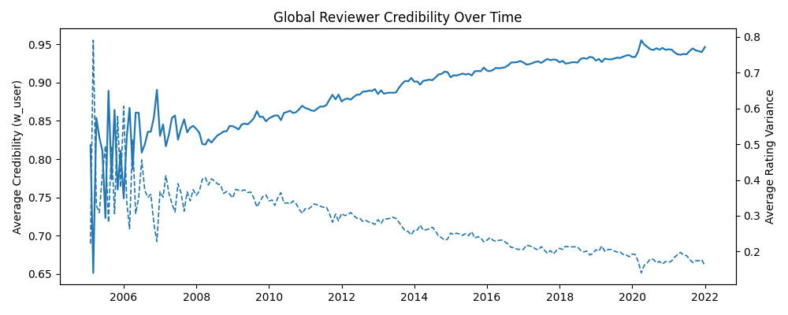
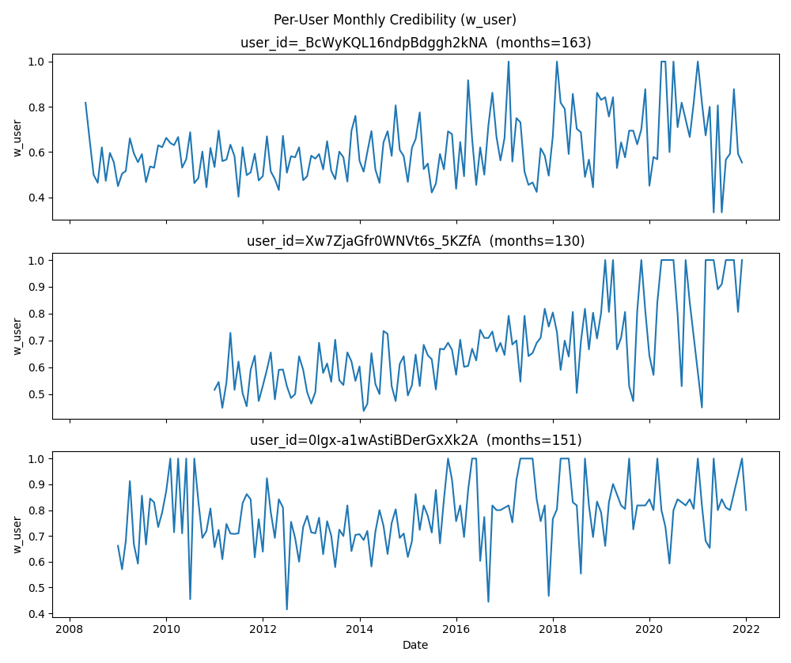
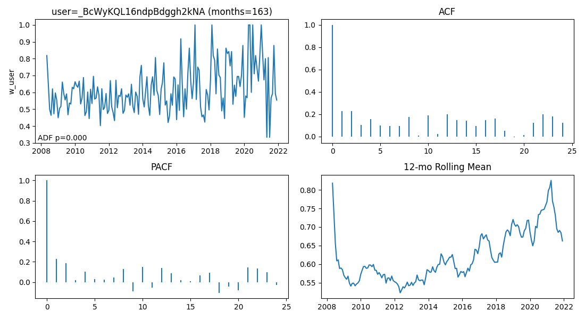
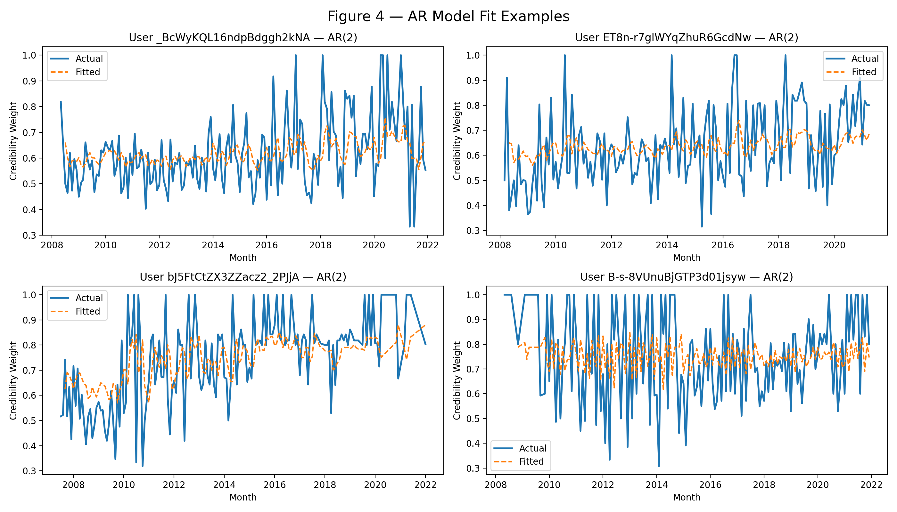

# User Credibility Weighting Evaluation

This folder (`creditability-weighting-evaluation/`) contains all scripts used to evaluate the reviewer credibility weighting formula:

\[
w_{\text{user}} = \frac{1}{1 + \mathrm{var\_pop}(\text{stars})}
\]

The evaluation reproduces all figures and statistics referenced in the report and poster:

- **Figure 1** – Global reviewer credibility and rating variance over time  
- **Figure 2** – Per-user monthly credibility trajectories  
- **Figure 3** – ACF/PACF + rolling-mean diagnostics for representative users  
- **Figure 4** – AR(1)/AR(2) model fit examples and persistence summaries :contentReference[oaicite:0]{index=0}  

This repository **does not include generated Parquet or `results/` files**. The grader can regenerate all required artifacts by running the scripts below.

---

## 0. Prerequisites

- Python 3.10+
- PySpark
- pandas, numpy, matplotlib, statsmodels, pyarrow
- Yelp dataset file:
  - `yelp_dataset/yelp_academic_dataset_review.json`
  - Expected location: **one level above** this folder:

visual-analytics-project/
├─ yelp_dataset/
│  └─ yelp_academic_dataset_review.json
└─ creditability-weighting-evaluation/
   ├─ run_ingest.py
   ├─ run_monthly_weights.py
   ├─ run_select_top_reviewers.py
   ├─ run_build_user_monthly_series.py
   └─ analyze/

All commands below assume:
- cd creditability-weighting-evaluation

## 1. These steps rebuild all Parquet datasets needed for the evaluation.

### 1.1 python3.10 run_ingest.py
- Ingest JSON → Parquet/year=YYYY/month=MM
- Converts yelp_academic_dataset_review.json (~5.34 GB) into partitioned Parquet by year/month.
- Input: ../yelp_dataset/yelp_academic_dataset_review.json
- Output: parquet/reviews/
- Partitioned as year=YYYY/month=MM/
+----------------------+-----+-------------------+-------------------+----+-----+
|user_id               |stars|date               |review_ts          |year|month|
+----------------------+-----+-------------------+-------------------+----+-----+
|mh_-eMZ6K5RLWhZyISBhwA|3.0  |2018-07-07 22:09:11|2018-07-07 22:09:11|2018|7    |
|OyoGAe7OKpv6SyGZT5g77Q|5.0  |2012-01-03 15:28:18|2012-01-03 15:28:18|2012|1    |
|8g_iMtfSiwikVnbP2etR0A|3.0  |2014-02-05 20:30:30|2014-02-05 20:30:30|2014|2    |
|_7bHUi9Uuf5__HHc_Q8guQ|5.0  |2015-01-04 00:01:03|2015-01-04 00:01:03|2015|1    |
|bcjbaE6dDog4jkNY91ncLQ|4.0  |2017-01-14 20:54:15|2017-01-14 20:54:15|2017|1    |
+----------------------+-----+-------------------+-------------------+----+-----+
only showing top 5 rows

### 1.2 python3.10 run_monthly_weights.py
- Compute monthly reviewer weights → parquet/weights/
- Compute monthly variance + credibility weight per (user_id, year, month)
- Input: parquet/reviews/
- Output: parquet/weights/
- Columns include: user_id, year, month, var_stars, w_user 
+----------------------+----+-----+-------------------+-------------------+     
|user_id               |year|month|var_stars          |w_user             |
+----------------------+----+-----+-------------------+-------------------+
|3zBJUlWtPNoZ0uN83ODbyg|2005|2    |0.22222222222222224|0.8181818181818181 |
|vetI1F4btXdQAe5G2A2ciA|2005|3    |0.0                |1.0                |
|58yhbFfNHjULDZx0FD-Dvw|2005|3    |1.6576000000000004 |0.3762793497892835 |
|3zBJUlWtPNoZ0uN83ODbyg|2005|3    |0.8888888888888888 |0.5294117647058824 |
|0FbtB0ajpk8VZSVpC6KjGw|2005|3    |0.22222222222222232|0.8181818181818181 |
|B6FbaEEn5Uh4kEqv4kUdgA|2005|3    |0.25               |0.8                |
|3MYdpmHeNwC6FquRWi3YOg|2005|3    |1.537190082644628  |0.39413680781758964|
|V1pxG6r8_zfkSpLnF7_GhA|2005|3    |0.0                |1.0                |
|XCsZ3hWa_6oP1WkWvK7pmg|2005|3    |1.142857142857143  |0.46666666666666656|
|9Z2UEd_f6eC17YxifpWfMw|2005|3    |0.5306122448979592 |0.6533333333333333 |
+----------------------+----+-----+-------------------+-------------------+
only showing top 10 rows

### 1.3 python3.10 run_select_top_reviewers.py
- Select top reviewers (k = 5000) → parquet/top_users/
- Selects the most active reviewers for downstream time-series analysis.
- Input: parquet/reviews/
- Output:parquet/top_users/ (Parquet) and parquet/top_users_csv/ (CSV) with user_id and n_reviews_total
+----------------------+---------------+                                        
|user_id               |n_reviews_total|
+----------------------+---------------+
|_BcWyKQL16ndpBdggh2kNA|3048           |
|Xw7ZjaGfr0WNVt6s_5KZfA|1840           |
|0Igx-a1wAstiBDerGxXk2A|1747           |
|-G7Zkl1wIWBBmD0KRy_sCw|1682           |
|ET8n-r7glWYqZhuR6GcdNw|1653           |
|bYENop4BuQepBjM1-BI3fA|1578           |
|1HM81n6n4iPIFU5d2Lokhw|1554           |
|fr1Hz2acAb3OaL3l6DyKNg|1447           |
|wXdbkFZsfDR7utJvbWElyA|1396           |
|Um5bfs5DH6eizgjH3xZsvg|1391           |
+----------------------+---------------+
only showing top 10 rows

### 1.4 python3.10 run_build_user_monthly_series.py
- Build per-user monthly series → parquet/user_monthly_weights/
- Builds a monthly time series of credibility for each selected user.
- Input: parquet/weights/, parquet/top_users/
- Output: parquet/user_monthly_weights/
- One partition per user: user_id=<ID>/...parquet

## 2. Reproducing Figures & Statistics
Once the Parquet data in Section 1 is generated, the grader can run the following analysis scripts to reproduce all figures and reported statistics.

### 2.1 Figure 1 — Global credibility vs rating variance
- Script: analyze/plot_global_credibility.py
- Input: parquet/weights/
- Behavior: Aggregates averages by (year, month): avg_w_user (average credibility), avg_var_stars (average rating variance)
- Prints correlation: Correlation(avg_w_user, avg_var_stars) ≈ -0.97  (expect negative)
- Displays the Figure 1 line plot: Solid line: average credibility (avg_w_user), Dashed line: average rating variance (avg_var_stars)
- Used in the report/poster as “Global Reviewer Credibility Over Time (Formula Behavior Check)”.

### 2.2 Figure 2 — Per-user monthly credibility trajectories
- Script: analyze/plot_user_series.py
- Input: parquet/user_monthly_weights/
- Behavior: Plots w_user over time for a small set of representative USER_IDS defined in the script, Displays Figure 2: Per-User Monthly Credibility (w_user) as stacked time series.
- This corresponds to the per-user trajectory examples described in the report.

### 2.3 Figure 3 — ACF/PACF + rolling-mean diagnostics
- Script: analyze/diagnose_user_series.py
- Input: parquet/user_monthly_weights/
- Behavior: Selects users with sufficient history (MIN_MONTHS in the script) and For each selected user, produces a 2×2 diagnostic panel: Credibility series over time, ACF, PACF, 12-month rolling mean. Prints a small meta-table of selected users (user_id, number of months, variance).
- These panels correspond to Figure 3 in the report/poster.

### 2.4 AR(1)/AR(2) modeling and summary table
- Quick smoke test on a subset: python3.10 analyze/model_user_ar_series.py --limit-users 300
- Full run on all users with ≥ 24 months: python3.10 analyze/model_user_ar_series.py
- Input: parquet/user_monthly_weights/
- Output (created fresh): results/ar_models/ar_model_summary.parquet and results/ar_models/ar_model_summary.csv
- Each row corresponds to one user and includes: best_order (1 or 2), phi1, phi2 (AR coefficients), aic, sigma2_resid, lb_pvalue_12 (Ljung–Box p-value at lag 12), first, last (date range)
- This table underlies the persistence and residual diagnostics described in the report (e.g., mean φ ≈ 0.17, small subset of users with potential GARCH-like behavior).

 Fit success: 96/96 users
    AR(1): 25, AR(2): 71
    Tip: inspect lowest-AIC users in the CSV; consider GARCH for large sigma2_resid.

### 2.5 Summarize AR results (persistence, residual flags)
- Script: analyze/summarize_ar_results.py
- Input: results/ar_models/ar_model_summary.csv
- Behavior (console output): Top 10 users by persistence (phi), Users with large residual variance or significant residual autocorrelation (lb_pvalue_12 < 0.05), Summary statistics for phi, aic, sigma2_resid.
- These numbers support the persistence narrative and “edge-case GARCH” discussion in the report.

Top 10 users by persistence (phi):
                                              user_id  best_order      phi1      phi2       phi         aic  n_obs
50  part-00050-3f343d2c-e7b8-4496-849a-8b4b06f2124...           1  0.570760       NaN  0.570760 -387.671640    164
8   part-00008-3f343d2c-e7b8-4496-849a-8b4b06f2124...           1  0.489055       NaN  0.489055 -367.850521    167
10  part-00010-3f343d2c-e7b8-4496-849a-8b4b06f2124...           1  0.477574       NaN  0.477574 -415.899222    173
84  part-00084-3f343d2c-e7b8-4496-849a-8b4b06f2124...           1  0.442589       NaN  0.442589 -306.828299    167
21  part-00021-3f343d2c-e7b8-4496-849a-8b4b06f2124...           2  0.152298  0.408139  0.408139 -277.563529    163
80  part-00080-3f343d2c-e7b8-4496-849a-8b4b06f2124...           1  0.386702       NaN  0.386702 -238.325665    169
61  part-00061-3f343d2c-e7b8-4496-849a-8b4b06f2124...           1  0.384497       NaN  0.384497 -313.595601    165
20  part-00020-3f343d2c-e7b8-4496-849a-8b4b06f2124...           2  0.214892  0.379846  0.379846 -324.586072    165
26  part-00026-3f343d2c-e7b8-4496-849a-8b4b06f2124...           2  0.314184  0.372115  0.372115 -343.791006    170
7   part-00007-3f343d2c-e7b8-4496-849a-8b4b06f2124...           1  0.345342       NaN  0.345342 -293.841833    184

Users that may need GARCH (large residual variance or serial correlation):
                                              user_id  best_order  sigma2_resid  lb_pvalue_12  n_obs
50  part-00050-3f343d2c-e7b8-4496-849a-8b4b06f2124...           1      0.005264  1.233090e-02    164
77  part-00077-3f343d2c-e7b8-4496-849a-8b4b06f2124...           1      0.005327  3.404295e-07    162
59  part-00059-3f343d2c-e7b8-4496-849a-8b4b06f2124...           2      0.005703  3.576182e-05    166
8   part-00008-3f343d2c-e7b8-4496-849a-8b4b06f2124...           1      0.006195  1.526099e-02    167
55  part-00055-3f343d2c-e7b8-4496-849a-8b4b06f2124...           2      0.006246  4.673705e-02    169
94  part-00094-3f343d2c-e7b8-4496-849a-8b4b06f2124...           1      0.006434  3.260125e-02    163
93  part-00093-3f343d2c-e7b8-4496-849a-8b4b06f2124...           2      0.006460  4.001199e-02    164
4   part-00004-3f343d2c-e7b8-4496-849a-8b4b06f2124...           2      0.006648  3.585962e-02    172
69  part-00069-3f343d2c-e7b8-4496-849a-8b4b06f2124...           2      0.006819  5.300426e-03    168
1   part-00001-3f343d2c-e7b8-4496-849a-8b4b06f2124...           1      0.006853  6.355849e-04    163
78  part-00078-3f343d2c-e7b8-4496-849a-8b4b06f2124...           2      0.006917  2.846512e-02    175
14  part-00014-3f343d2c-e7b8-4496-849a-8b4b06f2124...           2      0.007164  2.436667e-02    157

Distribution snapshots:
             phi         aic  sigma2_resid
count  96.000000   96.000000     96.000000
mean    0.174883 -309.405442      0.009105
std     0.141714   42.561805      0.002479
min    -0.096462 -415.899222      0.005067
25%     0.092043 -338.824974      0.007245
50%     0.178210 -307.280815      0.008765
75%     0.262541 -281.875857      0.010361
max     0.570760 -194.030067      0.015943

### 2.6 Figure 4 — AR model fit examples
- Script: analyze/plot_ar_examples.py
- Input: parquet/user_monthly_weights/
- Behavior: Loads all user time series into a DataFrame, Selects up to 4 users with at least 36 monthly observations, For each selected user: Fits AR(1) and AR(2), compares AIC, Plots actual vs fitted credibility series.
- Saves Figure 4: fig_ar_model_examples.png in the project root (creditability-weighting-evaluation folder.)
- This figure is used in the poster to illustrate AR fit quality and short-memory behavior.

